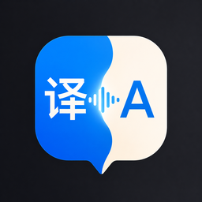

<p align="center">
  
</p>

<h1 align="center">mac-live-translate</h1>

<p align="center">
  <em>On-device, real-time Chinese → English translation for macOS. No cloud, no API keys, no waiting.</em>
</p>

<p align="center">
  
  
  
  
  
</p>

---

## Why I built this

I work in a Chinese company. In meetings my colleagues speak Mandarin and I don't always follow what they're saying. We have a human translator, but I wanted something that runs on my own Mac so I can understand the conversation *live*, without leaning on someone else and without sending audio to a cloud service.

This app turns my MacBook into a passive listener: open it, point the mic at the room, and read the English translation as people speak.

## How it works

- **Speech recognition:** Apple's `Speech` framework with `SFSpeechRecognizer(locale: "zh-CN")`. Runs on-device on Apple Silicon.
- **Translation:** Apple's `Translation` framework (macOS 15+). The Chinese → English model downloads once and then runs offline.
- **Filtering:** Only emits when the transcript contains CJK characters, so English chatter or background noise doesn't produce garbage Chinese output.
- **Pipeline:** Partial transcripts update the source pane immediately. Translation kicks in after a 300 ms debounce or on a final utterance — fast enough to feel live without burning cycles on every keystroke-worth of speech.
- **Robustness:** All Apple framework awaits are wrapped in `withTimeout`, the install state is verified by both `LanguageAvailability` *and* a test-translation probe, and the whole download flow has a 5-minute hard ceiling so the UI never sits at "downloading" forever.

Everything stays on the device. No accounts, no API keys, no network calls after the one-time model download.

## Features

- 🎙️  Auto-detects spoken Chinese — no push-to-talk needed
- ⚡  Real-time display of both the recognised Chinese and the English translation
- 📚  History list of finalized utterances with per-row delete and clear-all
- 🔁  Pausing the mic mid-sentence still captures the current utterance into history
- 📥  In-app overlay with time-based progress estimate during the one-time model download (Cancel + Retry escape hatches if Apple's framework stalls)
- 🛑  Mic is disabled until the translation model is fully installed (so the app never appears to "listen" before it can actually translate)
- 🧱  Clean VIPER architecture with protocol-based services — easy to mock, test, and extend

## Screenshots

> Pop these in once you have them — drop PNGs into `docs/` and reference like:
> ``

## Requirements

- macOS 15 (Sequoia) or later — Apple Translation framework is macOS 15+
- Apple Silicon recommended for the fastest on-device speech recognition
- Mic + Speech Recognition permission on first launch

## Project structure

```
mac-live-translate/
├── App/                       # @main composition root
├── Constants/                 # Metrics (layout) + Strings (text)
├── Entities/                  # TranslationState, TranslationEntry
├── Extensions/                # AppLogger, AsyncTimeout, String+Chinese
├── Services/
│   ├── SpeechRecognizing.swift          # protocol
│   ├── SpeechRecognitionService.swift   # Apple Speech wrapper
│   ├── Translating.swift                # protocol + DownloadState/Progress
│   ├── TranslationService.swift         # orchestrator
│   ├── TranslationDownloadConfig.swift  # all tunables in one place
│   ├── DownloadProgressTicker.swift     # time-based progress emit
│   └── TranslationInstallVerifier.swift # poll + try-translate fallback
└── Modules/
    └── Translate/             # feature module (VIPER)
        ├── TranslateBuilder.swift
        ├── TranslateProtocols.swift
        ├── TranslateInteractor.swift
        ├── TranslatePresenter.swift
        ├── TranslateView.swift          # composition only
        └── Views/                       # focused subviews
            ├── LanguagePillsRow.swift
            ├── TextPaneBox.swift
            ├── LiveTranscriptPanes.swift
            ├── MicToggleControl.swift
            ├── HistorySection.swift
            ├── ErrorBanner.swift
            └── DownloadOverlay.swift
mac-live-translateTests/        # mocks + 5 test suites (49 tests)
```

The Translate module follows a VIPER pattern. Services are exposed through protocols (`SpeechRecognizing`, `Translating`) so the interactor and presenter can be unit-tested with mocks instead of real audio and translation sessions. All download-flow tuning lives in `TranslationDownloadConfig` so behavior changes happen in one place.

## Build & run

```bash
open mac-live-translate.xcodeproj
# select the mac-live-translate scheme, press ⌘R
```

Or from the command line:

```bash
xcodebuild -project mac-live-translate.xcodeproj \
  -scheme mac-live-translate \
  -destination 'platform=macOS' \
  build
```

## Running the tests

```bash
xcodebuild -project mac-live-translate.xcodeproj \
  -scheme mac-live-translate \
  -destination 'platform=macOS' \
  test
```

The test target covers:
- CJK detection (`String+Chinese`)
- The async timeout helper (`withTimeout`)
- The transcript pipeline (`TranslateInteractor`): non-Chinese filter, debounce, dedup, history finalization, error and download-state forwarding
- Presenter state transitions, listen-gating, retry flow, history append/delete/clear, and finalize-on-pause regression

## First-run flow

1. Launch the app
2. Grant mic + speech recognition permissions
3. macOS opens its native "Download Languages to Translate" sheet — let Chinese (Mandarin, Simplified) and English (US) finish downloading
4. The in-app overlay tracks the install state and stays up until `LanguageAvailability` confirms the model is fully installed (the system framework can resolve its `prepareTranslation()` call before the bytes are really on disk, so we verify with a poll + a test translation)
5. Once ready, the mic auto-starts and the app begins translating

## Limitations

- Source language is fixed to Chinese (Simplified). Other Chinese variants would need additional locale plumbing.
- Target language is English only for v1. Indonesian was considered but Apple's Translation framework doesn't support `id-ID` on-device today — adding it would require a cloud fallback, which defeats the offline-first goal.
- Apple's `Translation` API doesn't expose download bytes/percent, so the in-app overlay uses a time-based estimate (capped at 95% until install is confirmed).

## License

MIT. Use it however you like.

---

<p align="center">
  Made with ☕ + a need to follow standup meetings.
</p>
